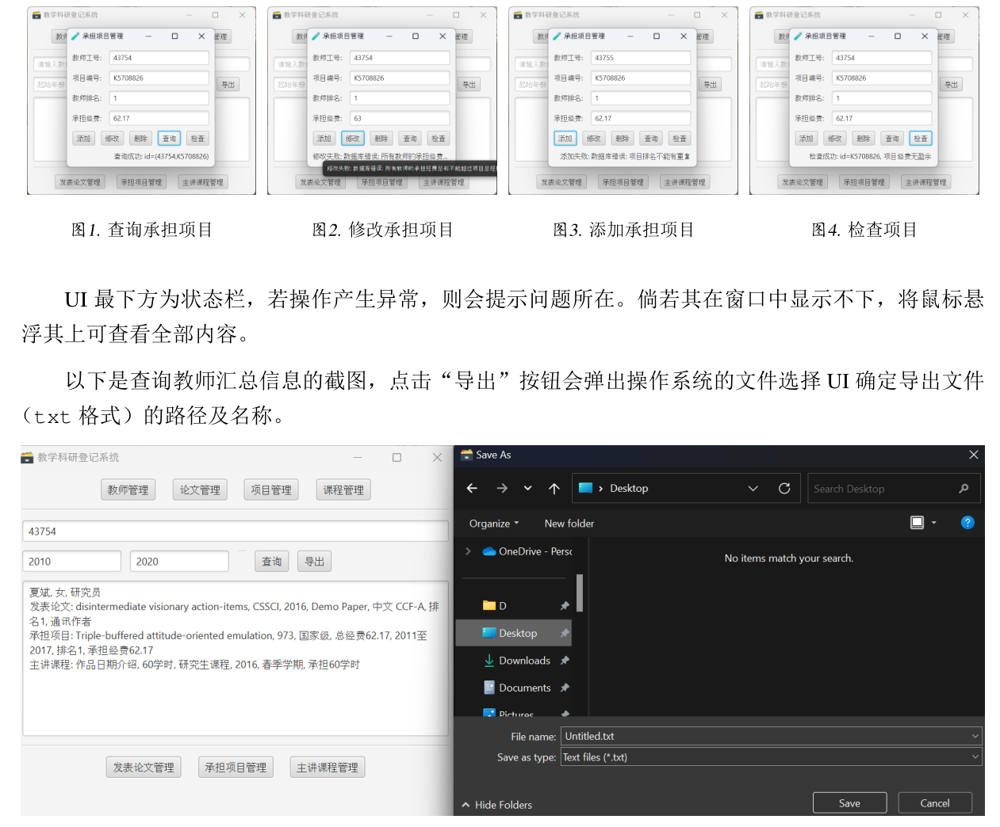

# TeacherDB

Please refer to the [requirement](docs/requirement.pdf) and [report](docs/report.pdf) (both in Chinese) for more information.

## Overview

TeacherDB is a database application designed to manage and record teaching and research activities of teachers. This system allows administrators to handle teacher information, manage publications, projects, and courses, and generate reports.

## Features

1. **Teacher Management**: Add, delete, modify, and query teacher information including ID, name, gender, and title.
2. **Publication Management**: Manage paper information with add, delete, modify, and query functionalities. Ensure unique corresponding authors and non-repeated author rankings.
3. **Project Management**: Handle project details with add, delete, modify, and query functionalities. Ensure non-repeated rankings and total allocated funds match project funds.
4. **Course Management**: Manage course information with add, delete, modify, and query functionalities. Ensure total teaching hours match course hours for each semester.
5. **Research and Teaching Summary**: Query and summarize a teacher's activities over a specified year range, with an option to export the data.

## System Design

### Architecture

The system is built using JavaFX for the GUI and MySQL for the database. The application is structured into several modules:

- **Main Application**: Entry point with navigation to different management functionalities.
- **Data Objects**: Represent entities like Teacher, Paper, Project, Course, etc., and handle database operations.
- **Database Handler**: Implements JDBC for database interactions.

### Workflow

1. **Main Interface**: Provides buttons for navigating to different management sections.
2. **Management Interfaces**: Allow CRUD operations on teachers, papers, projects, and courses.
3. **Validation**: Ensures data integrity through triggers and stored procedures.
4. **Export Functionality**: Enables data export to text files.

### Database Design

The database consists of seven tables: Teachers, Papers, Projects, Courses, PublishedPapers, ParticipatedProjects, and SelectedCourses. Triggers and procedures ensure data consistency and integrity.

## Implementation

### Environment

- **JDK**: OpenJDK 22.0.1
- **JavaFX**: 22.0.1
- **JDBC**: MySQL Connector/J 8.4.0

### Execution

To compile and run the program, specify the JavaFX and JDBC paths:

```bash
javac --module-path /path/to/javafx-sdk/lib --add-modules javafx.controls Main.java
java --module-path /path/to/javafx-sdk/lib --add-modules javafx.controls -cp ".;/path/to/mysql-connector-j-8.4.0.jar" Main
```

### Testing

The system has been thoroughly tested for functionality, including project management and teacher workload queries. Error handling is implemented to ensure stability.

## Challenges and Solutions

- **Project Fund Validation**: Implemented a "Check" button to verify total fund allocation.
- **JDBC Stored Procedures**: Adjusted data types to ensure compatibility with Java variables.

## Conclusion

TeacherDB effectively manages teacher-related data and provides robust querying capabilities. It highlights the use of JavaFX for GUI design and JDBC for database operations, ensuring data consistency and application stability.


